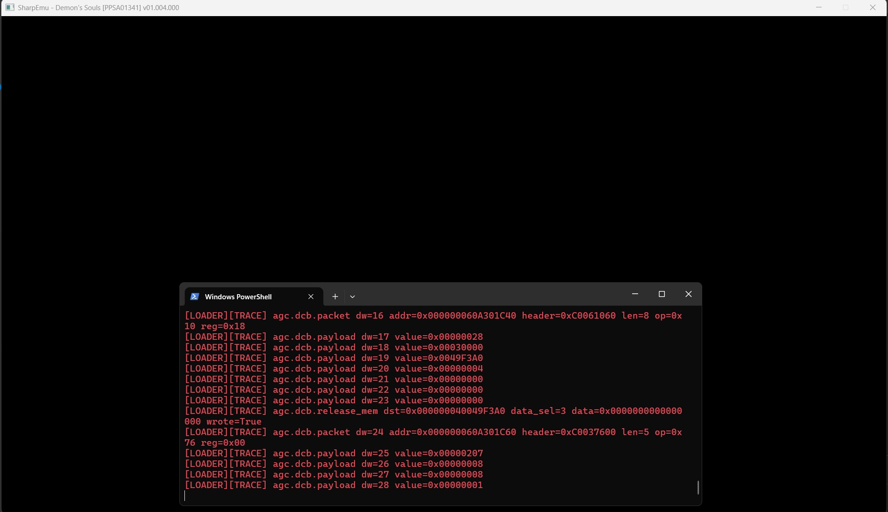
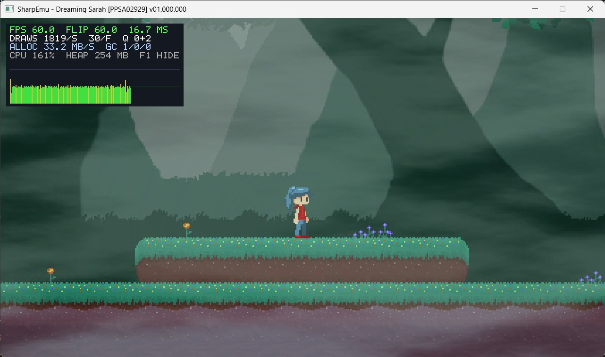

<!--
Copyright (C) 2026 SharpEmu Emulator Project
SPDX-License-Identifier: GPL-2.0-or-later
-->

# SharpEmu

<p align="center">
  
</p>

<p align="center">
  An experimental PlayStation 5 emulator for Windows, Linux and macOS.
</p>

<p align="center">
  <a href="https://discord.gg/6GejPEDqpc">
    
  </a>
</p>

> [!NOTE]
> SharpEmu supports Windows x64, Linux x64, and macOS x64. Apple Silicon Macs
> can run the macOS x64 build through Rosetta 2.

> [!WARNING]
> SharpEmu is an experimental PS5 emulator developed from scratch in C#. The
> current focus is accuracy and infrastructure rather than game-specific hacks.

## Info

SharpEmu is an early-stage emulator developed for research and educational
purposes. It focuses exclusively on PlayStation 5 software; PS4 emulation is
outside the project's scope.

## Status

The emulator can load `eboot.bin`, ELF, SELF, PRX, and system-module images,
execute native x86-64 guest code, dispatch a growing HLE surface, translate AGC
shaders to SPIR-V/Vulkan, and present video for some games.

Current capabilities include:

- ELF/SELF loading, relocation, imports, TLS, and module initialization
- Native CPU execution with structured trap and execution diagnostics
- Application metadata and content-bundle inspection
- Partial kernel, libc, Fiber, AMPR, PlayGo, audio, input, and savedata support
- Vulkan video output on Windows and Linux and MoltenVK output on macOS
- Windows, Linux, and macOS x64 release archives

Platform support remains experimental. Compatibility and performance vary by
game, operating system, and GPU driver.

## Using

Download the release archive for your operating system, extract it, and launch
SharpEmu with the path to a legally obtained game's `eboot.bin`.

Windows PowerShell:

```powershell
.\SharpEmu.exe "C:\path\to\game\eboot.bin" 2>&1 |
  Tee-Object -FilePath "SharpEmu.log"
```

Linux and macOS:

```bash
chmod +x ./SharpEmu
./SharpEmu "/path/to/game/eboot.bin" 2>&1 | tee SharpEmu.log
```

A Vulkan-capable GPU and current graphics driver are required. The macOS
release includes MoltenVK.

### Automation and inspection

- Add `--report-json execution.json` to atomically write a versioned,
  machine-readable execution result. Schema version 3 includes execution mode,
  loaded-image and module-initializer summaries, typed CPU/fault information,
  traces, application identity, executable SHA-256, timing, and host/build
  provenance.
- Add `--load-only` to validate and map the primary executable and adjacent
  modules without dispatching guest code. The report includes a
  path-independent bundle manifest with file sizes and SHA-256 fingerprints,
  making local regression baselines possible without storing copyrighted game
  files.
- Add `--expect-bundle-sha256 HASH` in load-only mode to require an exact local
  content bundle. A mismatch reports `BUNDLE_FINGERPRINT_MISMATCH` and exits
  with code 8.
- On Windows, add `--timeout-seconds N` to enforce a wall-clock execution
  budget. A timeout reports `EXECUTION_TIMED_OUT` and exits with code 7.
- Native watchdog termination reports `EXECUTION_STALLED` and exits with code
  6 instead of leaving automation without a result.

## Games Tested

- **Demon's Souls Remake**
  - [Demon's Souls [PPSA01341]](https://github.com/par274/sharpemu/issues/2)
  - Reaches a video loop while shader conversion work continues.
  
- **Poppy Playtime Chapter 1**
  - [Poppy Playtime Chapter 1 [PPSA20591]](https://github.com/par274/sharpemu/issues/3)
- **SILENT HILL: The Short Message**
  - [SILENT HILL: The Short Message [PPSA10112]](https://github.com/par274/sharpemu/issues/4)
- **Dreaming Sarah**
  - [Dreaming Sarah [PPSA02929]](https://github.com/par274/sharpemu/issues/9)
  - Reaches rendered gameplay on supported host/GPU configurations.
  

> [!IMPORTANT]
> This project does not support or condone piracy. All development and testing
> must use legally obtained software dumped from hardware owned by the user.

## Build

1. Install the .NET SDK version specified in [`global.json`](./global.json).
2. Clone the repository: `git clone https://github.com/par274/sharpemu.git`
3. Open `SharpEmu.slnx` in an IDE, or build with `dotnet build`.
4. Build artifacts are written below the `artifacts` directory.

The repository also provides `scripts/test-linux-docker.sh` for a pinned Linux
container smoke test and `scripts/fetch-macos-moltenvk.sh` for staging the
universal MoltenVK runtime used by macOS publishing.

## Disclaimer

SharpEmu is intended for research and education. It contains no copyrighted
system firmware, game data, or proprietary PlayStation assets.

## Special Thanks

- **[ShadPS4](https://github.com/shadps4-emu/shadPS4)** — architecture and
  low-level emulation references.
- **[Kyty](https://github.com/InoriRus/Kyty)** — PS5 native-execution research.
- **Ryujinx** — filesystem and low-level C# implementation references.

# License

[GPL-2.0 license](https://github.com/par274/sharpemu/blob/main/LICENSE)

## Contributing

Read [CONTRIBUTING.md](./CONTRIBUTING.md) before opening an issue or pull
request. It documents coding style, AI-assisted contributions, testing, pull
request expectations, and the project's legal/reverse-engineering policy.
